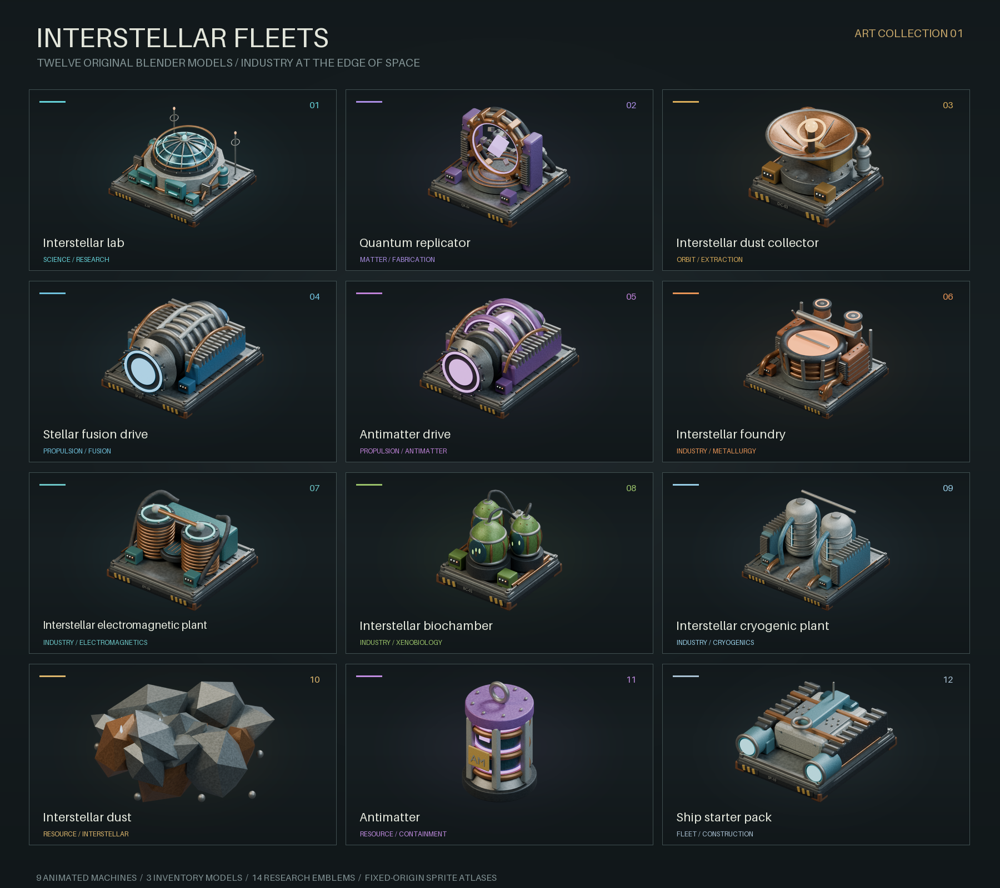

# Interstellar Fleets

Interstellar Fleets is an endgame Factorio: Space Age mod for players who have reached Promethium science and want a larger post-Shattered Planet objective without simulating hundreds of duplicate space platforms. It adds a deep-space fleet layer built around interstellar dust harvesting, quantum replication, relativistic drives, and a UPS-friendly fleet multiplier system.

The core idea is simple: once a platform design is stable, you can merge additional identical ships into a single represented fleet. The game keeps simulating one platform surface, while the mod tracks a fleet size multiplier and applies the benefits where they matter. This keeps the fantasy of operating a large interstellar armada without forcing Factorio to run every ship as a separate platform with duplicated machines, belts, inserters, collectors, and labs.

## Gameplay Summary

The mod extends Space Age after Promethium science with a new interstellar progression arc.

First, `Interstellar fleets` unlocks interstellar labs, interstellar dust collectors, stellar fusion drives, and a very long route toward the Galactic Center. The Galactic Center is intentionally extreme: it is far away, solar power is weak, and the route is effectively a late-game endurance project rather than a normal planet hop.

Interstellar dust collectors gather `interstellar-dust` while installed on space platforms. Runtime dust income scales with the platform fleet size and current relativistic speed, so a consolidated fleet still behaves like many ships harvesting dust without requiring every duplicate ship to exist as a fully simulated platform.

`Quantum replication` unlocks the quantum replicator and dust-based recipes for raw materials. Replicators convert interstellar dust into ores and other Space Age raw resources such as iron ore, copper ore, coal, stone, uranium ore, carbon, ice, scrap, calcite, tungsten ore, holmium ore, lithium, and promethium asteroid chunks. Follow-up technologies specialize the system: `Antimatter containment` unlocks expensive antimatter replication, `Interstellar xenobiology` unlocks dust-based biological crops, bioflux, biter eggs, and pentapod eggs, and `Quantum fabrication` unlocks expensive replication of advanced construction parts.

`Orbital industry` unlocks space-safe interstellar variants of planet-specialized production machines: foundries, electromagnetic plants, biochambers, and cryogenic plants. These variants are built from interstellar dust plus resources available through quantum replication, remove the planet-only placement restriction, and let mature platforms run more complete Space Age production chains in deep space without mutating the vanilla buildings globally.

`Interstellar dust crushing` unlocks an asteroid-crusher recipe that reprocesses dust back into dust while occasionally exposing metallic, carbonic, oxide, and rare promethium asteroid chunks. `Deep dust prospecting` adds a stronger dust-crushing recipe with better asteroid and promethium yields. This gives players a more Factorio-native alternative to direct promethium chunk replication: build crushers, handle probabilistic outputs, and sort mixed asteroid materials on-platform.

`Fleet printing` unlocks ship starter packs and antimatter drives. A ship starter pack represents the cost of adding one more matching platform to the fleet. Stellar fusion drives consume fusion power cells for dependable acceleration. Antimatter drives consume replicated antimatter and provide much stronger thrust, turning antimatter production into the premium fuel loop for high-speed interstellar travel. The fleet UI includes an auto-boost toggle so mature platforms can automate acceleration instead of requiring repeated manual boost clicks.

## Fleet Consolidation

Use the `Interstellar fleets` shortcut or `SHIFT + I` while standing on a space platform to open the fleet interface.

The interface exposes five actions:

- `Merge ship`: consumes one `ship-starter-pack` from the platform hub and increases fleet size by one.
- `Split fleet`: divides the current fleet roughly in half and creates a new platform for the split-off ships.
- `Update blueprint`: records the current platform layout as the fleet's matching layout.
- `Boost`: consumes fusion power cells and/or antimatter to increase fleet speed based on installed drives.
- `Auto boost`: toggles continuous once-per-second boosting while drives and matching fuel are available, pausing silently when fuel runs short.

Merge protection is intentionally strict. Layout checks include entity quality, exact positions, and platform foundation tiles. Existing fleets recorded before 0.2.2 need one explicit `Update blueprint` before merging again. The mod records a compact signature of the represented platform layout. If the platform changes after consolidation, further merging is blocked until you either update the blueprint or split the fleet. This prevents a fleet of supposedly identical ships from silently drifting out of sync with the one platform that Factorio is actually simulating.

Splitting creates and verifies the new layout before committing either fleet size. If creation or cloning fails, the source fleet and its crafting progress are unchanged. After a successful split, partial crafting and bonus progress are cleared on both platforms. The new hub starts empty; machine inventories, belts, and fluids are currently cloned with the layout; proportional stock division remains a known economy limitation.

## New Content

- `Interstellar dust`: exotic deep-space material gathered by fleet collectors.
- `Interstellar lab`: advanced research building whose research speed is boosted by fleet scaling.
- `Quantum replicator`: production machine for dust-to-resource conversion.
- `Interstellar dust collector`: upgraded collector for deep-space dust harvesting.
- `Interstellar foundry`, `electromagnetic plant`, `biochamber`, and `cryogenic plant`: space-safe versions of planet-specialized production buildings.
- `Stellar fusion drive`: blue-glow relativistic drive for fleet acceleration.
- `Antimatter`: expensive replicated drive fuel made from interstellar dust and fusion power cells, now represented by a distinct containment-capsule icon instead of reusing the antimatter drive art.
- `Antimatter drive`: purple high-output drive with stronger acceleration and separate antimatter fuel.
- `Ship starter pack`: expensive platform package consumed when merging ships into a fleet.
- `Galactic Center`: a distant Space Age location and long-haul objective beyond normal platform logistics.
- Expanded research progression splits antimatter containment, xenobiology, quantum fabrication, orbital industry, and deep dust prospecting into dedicated milestones.
- Expanded quantum replication inputs include advanced construction parts, biological inputs, eggs, and promethium asteroid chunks. Orbital industry adds dedicated metallurgic, electromagnetic, agricultural, and cryogenic science recipes that run only in the matching interstellar machines, without removing vanilla planet restrictions. Cryogenic science still needs imported fluorine/ammonia or fluoroketone; indefinite all-science self-sufficiency is not yet complete. Building additional labs, replicators, and drives also requires some planet-built components.
- `Interstellar dust crushing` and `Advanced interstellar dust crushing`: asteroid-crusher recipes that recover part of the dust input and roll for metallic, carbonic, oxide, and promethium asteroid chunks.

## Art Direction

The complete original Blender collection gives Interstellar Fleets a shared industrial identity: cast metal, copper plumbing, worn panels, ceramic insulation, and restrained process lighting. All nine custom machine bodies and their icons are now used in-game, with the correct Factorio 2.0 graphics fields and unchanged gameplay footprints.



- **12 editable Blender models**: nine machines plus distinct dust, antimatter, and ship starter pack models.
- **27 registered sprite atlases**: eight-frame body, emission, and geometric shadow passes; the collector includes four directions.
- **12 inventory icons and 14 distinct technology images**, derived from the same models.
- **Individual sample boards, transparent hero renders, nine animated previews, fleet key art, and a new thumbnail.**

Browse the [sample images](art/samples), [Blender sources](art/models), or [art review gallery](wiki/art-review.html). The [art guide](docs/ART.md) explains the pipeline and includes a sample/source link for every model. `art/manifest.json` records dimensions, source relationships, and SHA-256 checksums.

The lab uses custom on/off animations, crafting machines use `graphics_set`, and the item-fueled drives use simple-entity animations. Native collector arms and fluid socket overlays remain functional. The renderer keeps every animation frame and pass registered to the same origin; the packer does not independently crop machine frames. Legacy reference images under `graphics/source` remain historical material and are not inputs to this collection.

Rebuild from the repository root with Blender and Python/Pillow:

```sh
blender -b --python-exit-code 1 --python scripts/blender_render_assets.py -- --asset all --samples 32
python3 scripts/pack_blender_assets.py
python3 scripts/validate_art_assets.py --blender blender
```

## Balance Intent

Interstellar Fleets is deliberately late-game:

- Reaching the Shattered Planet unlocks the base interstellar technology for free; follow-up research is deliberately expensive.
- Recipes require expensive Space Age intermediates.
- Fleet merging consumes ship starter packs instead of being free.
- Fusion acceleration consumes fusion power cells; antimatter acceleration consumes expensive replicated antimatter.
- Infinite drive-efficiency research reduces boost fuel costs over time: stellar fusion drive efficiency reduces fusion-cell cost by 8% per level, and antimatter drive efficiency reduces antimatter cost by 10% per level. Both efficiency chains floor at 20% of the original cost so high-speed travel remains a logistics problem.
- Infinite dust collection productivity increases scripted collector output by 8% per level, quantum replication productivity adds 4% productivity per level to replication recipes, and fleet coordination increases the fleet-size production speed bonus by 3% per level.
- Acceleration becomes harder at high relativistic speed.
- The Galactic Center route is extremely long and low-solar, making ship design, fuel logistics, and fleet scaling matter.

The goal is not to trivialize Space Age. The goal is to give mature megabases a new scaling problem after normal planetary expansion is solved.

## Current Implementation Notes

- Fleet state is stored in Factorio `storage` by platform index.
- The represented platform receives additive surface-level speed and energy-consumption effects based on fleet size, approximating the throughput and power draw of the abstract ships while preserving other mods’ effects.
- Dust collection, auto boost, and distance advancement run periodically in `control.lua`.
- Dust overflow is buffered in a bounded per-fleet backlog that drains into the hub as space frees up; when the backlog is full, collection pauses like any output-blocked machine. Overflow is never spilled as ground items, which at fleet scale would create thousands of entities and destroy UPS.
- Merge/split operations are exposed through a custom GUI and shortcut.
- Platform layout matching uses a deterministic signature that ignores transient entities such as cargo pods, construction ghosts, robots, and spilled items, so in-transit deliveries and in-progress hub construction do not spuriously block merges.
- Split fleets clone the represented platform layout when Factorio can create the destination platform.

## Files

- `info.json`: mod metadata and Space Age dependency.
- `thumbnail.png`: mod thumbnail.
- `graphics/`: generated icon and technology artwork.
- `prototypes/`: items, entities, recipes, technologies, shortcuts, and space locations.
- `locale/`: player-facing names and descriptions.
- `control.lua`: runtime fleet state, GUI, merge/split, dust collection, acceleration, and fleet multipliers.
- `docs/PRD.md`: product requirements derived from the original brainstorming conversation.
- `docs/DESIGN.md`: implementation design for the current mod architecture.
- `docs/VALIDATION.md`: command-line validation steps, soft-lock review, and balance notes.

## Build

Build the release zip with Python 3.10 or later (no build dependencies):

```sh
python scripts/build.py
```

The existing PowerShell entry point, `scripts/build.ps1`, calls the same builder. It creates `dist/interstellar-fleets_<version>.zip` with Factorio's required top-level folder and POSIX ZIP paths on every operating system. Output is reproducible and written atomically.

The checked-in `dist/interstellar-fleets_0.2.1.zip` is a historical build with nonportable ZIP paths; do not use it to install this version. Build 0.2.2 from the current source with the command above, or download `interstellar-fleets-validation` from a successful GitHub Actions run. New generated ZIPs are kept as CI artifacts rather than committed to Git.

Run the regression suite and asset validation:

```sh
python -m pip install -r requirements-dev.txt
python scripts/test.py
```

For actual Factorio data-stage, fleet merge/split, and surface-effect checks:

```sh
python scripts/smoke_test.py /path/to/factorio/bin/x64/factorio
```

The official free Linux headless download includes Space Age. CI pins Factorio 2.0.77 and validates its SHA-256. Logs are written under `validation/`; successful process exit is insufficient unless the mod and its test completion markers appear. See [validation notes](docs/VALIDATION.md) for coverage and remaining limitations.
